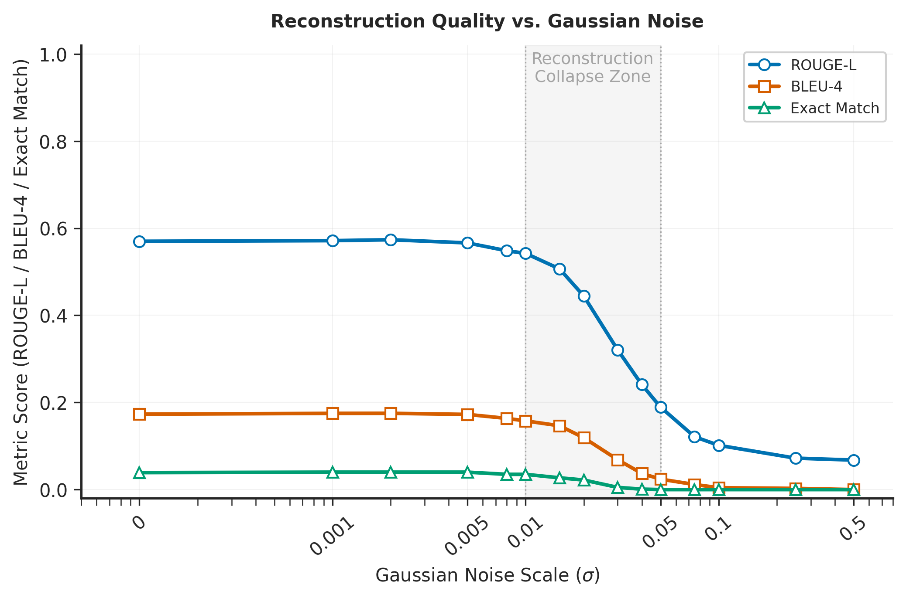
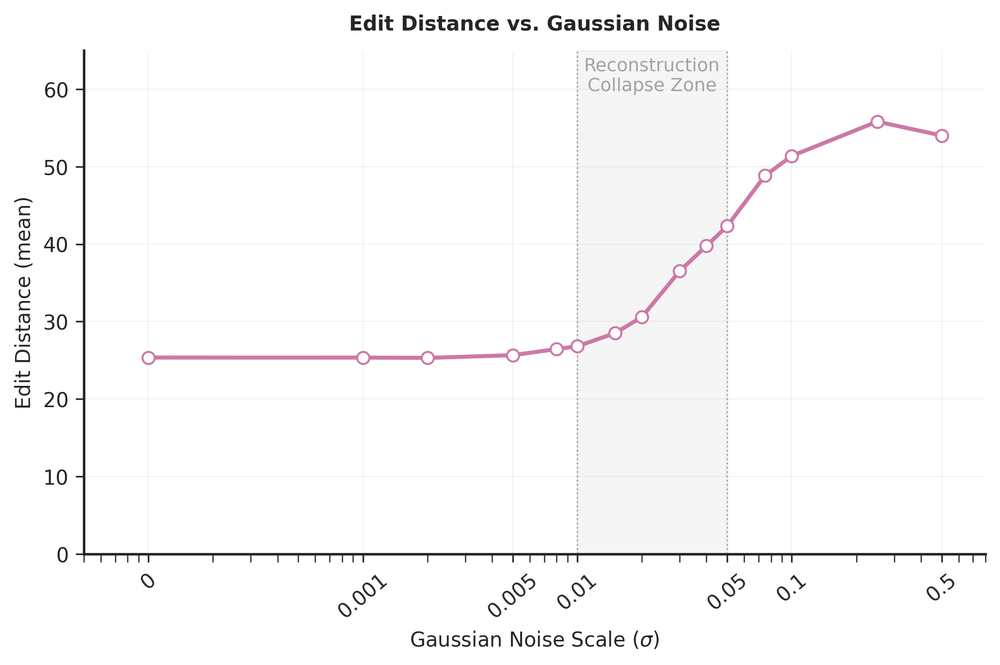
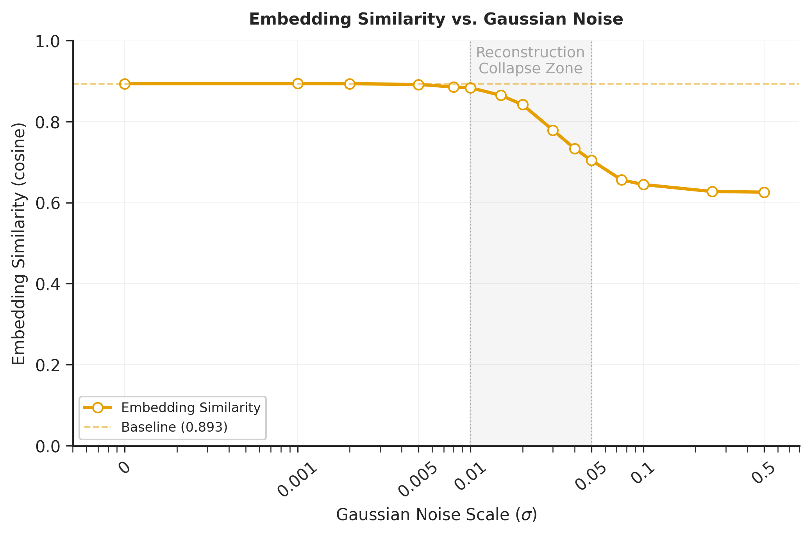
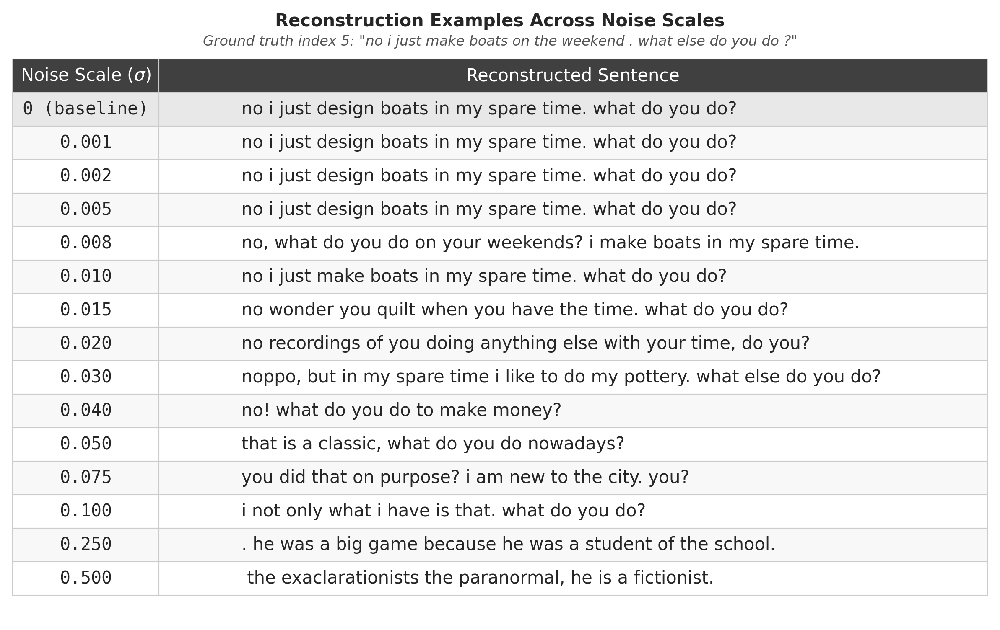

# **Defending Against Generative Embedding Inversion Attacks via Gaussian Noise Perturbation**

Privacy-Preserving Data Analysis — Final Project
**Wen-Ho Wang**

May 2026

---

## Background & Motivation

- **Generative Embedding Inversion Attack (GEIA)**: Sentence embeddings can be inverted to recover the **original text** with high fidelity, which is a serious privacy risk for systems sharing embeddings
- **Key finding (Li et al., ACL 2023)**: Embeddings leak far more than previously assumed; attackers can reconstruct full sentences, not just attributes
- **Research question**: Can adding **Gaussian noise** to embeddings prior to transmission neutralize GEIA while preserving semantic utility?
- **Approach**: Systematically evaluate **15 noise scales** ( $\sigma \in [0, 0.5]$ ) across multiple metrics

<!-- _footer: Li et al., "Sentence Embedding Leaks More Information than You Expect", ACL 2023 Findings -->

---

## Experimental Setup

| Parameter | Value |
| ----------- | ------- |
| **Dataset** | PersonaChat |
| **Victim embedding model** | `all-mpnet-base-v1` (110M) |
| **Attacker model** | `DialoGPT-large` (762M) |
| **Decoding** | Beam search (size = 5) |
| **Training** | 5 epochs, AdamW (batch size = 16) |
| **Noise scales** | 15 levels: $\sigma \in [0,\;0.5]$ |
| **Test samples** | 1,000 sentences |
| **Hardware** | NVIDIA RTX 4090 (24 GB) |

---

## Implementation

- **Core modification** in `scripts/test_attacker.py`:

  ```python
  noise = torch.randn_like(embeddings) * noise_scale
  embeddings = embeddings + noise

  pred_list, gt_list = eval_on_batch(batch_X=embeddings, ...)
  ```

- Attacker is **trained on clean embeddings**, then tested with noise.

---

## Evaluation Metrics

- **ROUGE-L**: Longest common subsequence-based F1 score
- **BLEU-4**: n-gram precision up to 4-grams
- **Exact Match (EM)**: % of predictions that exactly match the original sentence
- **Embedding Similarity**: Cosine similarity between predicted and original sentence embeddings
- **Qualitative Analysis**: Manual inspection of reconstructed sentences at key noise levels

---

## Figure 1 — Reconstruction Quality



---

## Figure 2 — Edit Distance



---

## Figure 3 — Embedding Similarity



---

## Figure 4 — Qualitative Examples



---

## Discussion — Three Regions

- **Immune Region** ( $\sigma \in [0, 0.01]$ ): Metrics indistinguishable from noise-free baseline. ROUGE-L stays ~0.54–0.57. **Noise is too small to matter.**
- **Transition Region** ( $\sigma \in (0.01, 0.05)$ ): Rapid, monotonic degradation across **all** metrics. ROUGE-L falls from 0.51 → 0.24, BLEU-4 drops ~75%.
- **Failure Region** ( $\sigma \in [0.05, \infty)$ ): Exact Match = **0%**, BLEU-4 ≈ 0, ROUGE-L < 0.19. Attack outputs are **effectively random**.

> **Key insight**: A sharp **threshold effect** exists rather than a gradual decay — small increases in $\sigma$ near 0.01–0.05 can flip the defense from ineffective to fully effective.

---

## Conclusions

- **Tiny noise is not a defense** — attackers are resilient to $\sigma \leq 0.01$
- **Effective noise degrades utility** — the same perturbation that blocks the attack also distorts embeddings for downstream tasks
- **Connection to Differential Privacy**: Gaussian noise is the core DP mechanism; calibrated noise with sensitivity analysis could provide **provable guarantees**

---

## Contributions

- **8 new scripts** in `scripts/` for training, testing, evaluation, and visualization
- **Modified** `data_process.py` and `eval_generation.py` to support noisy embedding pipelines
- **Systematic quantification** of the noise threshold ( $\sigma \approx 0.01$–$0.05$ ) where GEIA begins to fail
- **Comprehensive evaluation** across **15 noise scales** and **5 metrics**, revealing three distinct defense regions
- **Qualitative analysis** confirming that **noise levels ≥ 0.05** render reconstructions semantically unrelated
