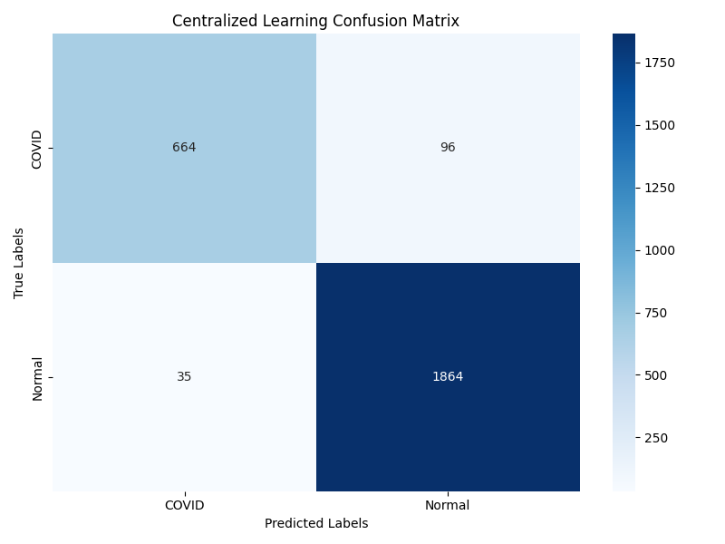
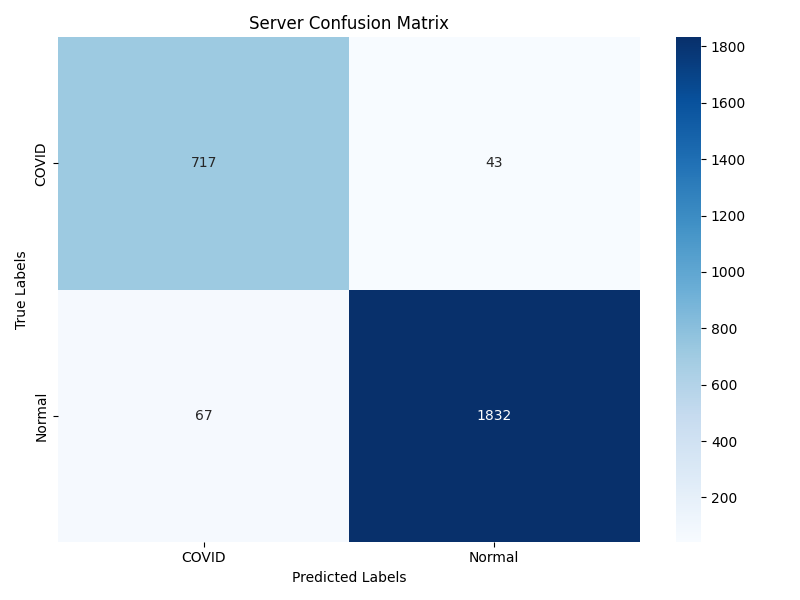
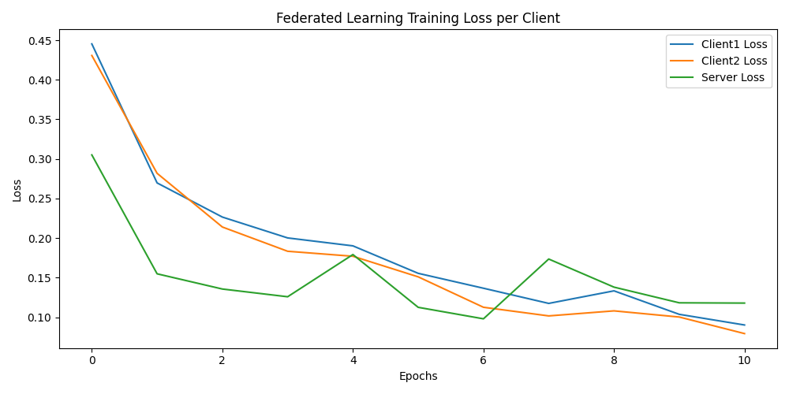

# Homework 1: Centralized vs. Federated Learning

## 1. Project Overview

This project compares **Centralized Learning (CL)** and **Federated Learning (FL)** for binary classification of chest X-ray images into **COVID-19** and **Normal** cases.

In the centralized setting, all training data is pooled to train a global model via 5-fold cross-validation followed by full-dataset retraining. In the federated setting, data is distributed across two non-overlapping clients, and a global model is learned via the **Federated Averaging (FedAvg)** algorithm without any raw data leaving the clients. A held-out server test set provides an unbiased evaluation of the global model's performance.

The project is built with **Python 3.13**, **PyTorch 2.10**, **TorchVision 0.25**, **scikit-learn**, **Matplotlib**, and **Seaborn**, and uses **`uv`** for dependency management.

---

## 2. How to Use

### 2.1 Prerequisites

Install `uv` for Python dependency management. You can install it via the following command:

```bash
curl -LsSf https://astral.sh/uv/install.sh | sh
```

or refer to the [official documentation](https://docs.astral.sh/uv/#installation) for alternative installation methods.

### 2.2 Environment Setup

Navigate to the `hw1/` directory and install all dependencies with a single command:

```bash
cd hw1
uv sync
```

This will create a virtual environment and install all required packages (PyTorch, TorchVision, scikit-learn, Matplotlib, Seaborn, tqdm, etc.) as specified in `pyproject.toml`.

> [!IMPORTANT]
> In this project, we use PyTorch 2.10 and TorchVision 0.25, which require CUDA 12.8 for GPU acceleration. Ensure that your system has the appropriate CUDA version installed and configured to leverage GPU capabilities during training.

### 2.3 Running the Experiments

All commands must be executed from the `hw1/` directory.

#### Centralized Learning

```bash
uv run python centralized_learning.py
```

- Trains a ResNet-18 model with 5-fold cross-validation, followed by full-dataset retraining.
- Output: `outputs/cl/results/cl_confusion_matrix.png`, model checkpoints in `outputs/cl/checkpoints/`.

#### Federated Learning

```bash
uv run python federated_learning.py
```

- Simulates a federated setting with 2 clients using FedAvg aggregation over 20 rounds (with early stopping).
- Output: Confusion matrices in `outputs/fl/results/`, loss curve in `outputs/fl/federated_learning_loss.png`, model checkpoints in `outputs/fl/checkpoints/`.

#### Run Both Sequentially

```bash
uv run python main.py
```

- Executes Centralized Learning first, then Federated Learning. All outputs are saved to the same directories as above.

## 3. Model Selection & Architecture

### 3.1 Backbone: ResNet-18

A **ResNet-18** pre-trained on ImageNet (`torchvision.models.resnet18(weights=ResNet18_Weights.DEFAULT)`) serves as the feature extraction backbone for both the CL and FL pipelines. ResNet-18 was chosen for its balance of representational capacity and computational efficiency, making it well-suited for medical image analysis tasks with limited data.

### 3.2 Grayscale Input Adaptation

Chest X-rays are single-channel (grayscale) images, whereas ResNet-18 expects three-channel RGB input. The first convolutional layer is replaced accordingly:

```python
original_conv1 = self.backbone.conv1
self.backbone.conv1 = nn.Conv2d(1, 64, kernel_size=7, stride=2, padding=3, bias=False)
with torch.no_grad():
    self.backbone.conv1.weight = nn.Parameter(
        original_conv1.weight.mean(dim=1, keepdim=True)
    )
```

The pre-trained 3-channel filters are averaged along the channel dimension to initialize the single-channel filter, preserving the learned spatial features.

### 3.3 Layer Freezing Strategy

To prevent overfitting on the relatively small medical dataset and to accelerate training, early layers are frozen while deeper layers are fine-tuned:

| Module     | `requires_grad` | Rationale                                                   |
|------------|-----------------|-------------------------------------------------------------|
| `conv1`    | `False`         | Learns low-level edges / textures; general across domains   |
| `bn1`      | `False`         | Paired with `conv1`; frozen to preserve batch statistics    |
| `layer1`   | `False`         | Low-level features; general enough to transfer directly     |
| `layer2`   | `True`          | Mid-level features; benefits from domain-specific tuning    |
| `layer3`   | `True`          | High-level semantic features; task-specific                 |
| `layer4`   | `True`          | Highest-level features; most task-specific                  |
| `fc`       | `True`          | Replaced entirely; must be learned from scratch             |

### 3.4 Classifier Head

The original 1000-class fully connected layer is replaced with a two-layer head:

```python
nn.Sequential(
    nn.Dropout(0.5),
    nn.Linear(512, 2),
)
```

A dropout rate of 0.5 is applied before the final linear projection to regularize the classifier and mitigate overfitting.

### 3.5 BatchNorm Handling

Frozen BatchNorm layers (`bn1` and those inside `layer1`) are explicitly set to **eval mode** during training to prevent updates to their running mean and variance statistics:

```python
for name, module in model.backbone.named_modules():
    if name.startswith("bn1") or name.startswith("layer1"):
        if isinstance(module, nn.BatchNorm2d):
            module.eval()
```

This avoids corrupted statistics that would otherwise arise from the small, non-i.i.d. mini-batches seen during fine-tuning.

---

## 4. Project Structure

```text
hw1/
├── README.md                         # This report
├── pyproject.toml                    # Project metadata & dependencies (uv)
├── centralized_learning.py           # Centralized Learning implementation
├── federated_learning.py             # Federated Learning implementation
├── main.py                           # Entry-point that runs centralized_learning then federated_learning sequentially
├── data/
│   ├── CentralizedLearning/
│   │   └── task/
│   │       ├── train/                # CL training set (COVID / Normal)
│   │       └── test/                 # CL test set (COVID / Normal)
│   └── FederatedLearning/
│       ├── Client1/
│       │   ├── train/                # Client 1 training set
│       │   └── test/                 # Client 1 test set
│       ├── Client2/
│       │   ├── train/                # Client 2 training set
│       │   └── test/                 # Client 2 test set
│       └── Server/
│           └── test/                 # Server held-out test set
├── outputs/                          # Generated checkpoints & figures
│   ├── cl/
│   │   ├── checkpoints/              # K-fold & final CL models
│   │   └── results/                  # CL confusion matrix
│   └── fl/
│       ├── checkpoints/              # Per-round & best FL models
│       └── results/                  # FL confusion matrices & loss curve
└── docs/
    ├── homework description.pdf
    └── sample_code/
        ├── centralized_learning.py
        └── federated_learning.py
```

---

## 5. Data Preprocessing & Augmentation

### 5.1 Transformation Pipelines

Chest X-ray images are single-channel grayscale, resized to 224×224. The following transforms are applied:

#### Train

| Transform | Purpose |
| ----------- | --------- |
| `Grayscale(num_output_channels=1)` | Convert to single channel |
| `Resize((224, 224))` | Standardize input dimensions |
| `RandomHorizontalFlip(p=0.3)` | Horizontal flip augmentation |
| `RandomAffine(degrees=5, translate=0.05, scale=(0.95, 1.05))` | Small rotations, shifts, scaling |
| `ColorJitter(brightness=0.15, contrast=0.15)` | Brightness & contrast variation |
| `GaussianBlur(kernel_size=9, sigma=(0.5, 2.0), p=0.8)` | Blur augmentation (applied 80% of samples) |
| `ToTensor()` | Convert to tensor |
| `Normalize(mean=[0.5], std=[0.5])` | Normalize to [-1, 1] |

#### Test

| Transform | Purpose |
| ----------- | --------- |
| `Grayscale(num_output_channels=1)` | Convert to single channel |
| `Resize((224, 224))` | Standardize input dimensions |
| `ToTensor()` | Convert to tensor |
| `Normalize(mean=[0.5], std=[0.5])` | Normalize to [-1, 1] |

### 5.2 Class Imbalance Handling

Weights are computed inversely proportional to class frequency to re-weight the `CrossEntropyLoss`:

```python
class_counts = torch.bincount(torch.tensor(train_dataset.targets))
total_samples = class_counts.sum().float()
class_weights = total_samples / (num_classes * class_counts.float())
```

This ensures that the loss function places higher importance on the minority class during gradient updates.

### 5.3 Data Loader Hyperparameters

| Parameter | Value |
| --------- | ----- |
| Batch size | 32 |
| Workers | 4 |
| Pin memory | True |
| Shuffle | True (train) / False (test) |

---

## 6. Centralized Learning

### 6.1 Overview

The `CentralizedLearning` class in `centralized_learning.py` implements a **two-phase training** pipeline designed to robustly estimate the optimal number of training epochs without a dedicated validation split.

### 6.2 Phase 1: K-Fold Cross-Validation

- **5 folds** are created from the centralized training set via `KFold(n_splits=5, shuffle=True)`.
- For each fold, a fresh ResNet-18 model is trained for up to **20 epochs** using **AdamW** (`lr = 5e-4`, `weight_decay = 1e-4`).
- **Early stopping** with patience of **5 epochs** monitors validation loss. The best model per fold is saved as `best_model_fold_{k}.pt`.
- The number of epochs that produced the lowest validation loss in each fold is recorded. The **optimal epoch count** is taken as the integer average across all folds.

| Phase 1 Hyperparameter | Value        |
|------------------------|--------------|
| Optimizer              | AdamW        |
| Learning rate          | 5e-4     |
| Weight decay           | 1e-4     |
| Max epochs per fold    | 20           |
| Number of folds        | 5            |
| Early stopping patience| 5            |

### 6.3 Phase 2: Full-Dataset Retraining

- A new model is initialized and trained on the **entire training set** for the averaged optimal number of epochs.
- The final model is saved as `cl_model.pt`.
- Evaluation is performed on the held-out test set, producing:

  - **Test loss**
  - **Accuracy**
  - **Weighted F1-score**
  - **Precision & Recall**
  - **Confusion matrix** (saved as `cl_confusion_matrix.png`)
  - Full `classification_report`

### 6.4 Evaluation Metrics

All metrics are computed via `scikit-learn`:

- **Accuracy**: proportion of correctly classified samples.
- **Weighted F1-score**: harmonic mean of precision and recall, averaged with support-weighting to account for class imbalance.
- **Confusion Matrix**: 2 × 2 matrix visualizing true vs. predicted labels for COVID and Normal classes.

---

## 7. Federated Learning

### 7.1 Overview

The `FederatedLearning` class in `federated_learning.py` simulates a **horizontally federated** setting with **two clients** and a **central server**. Each client holds a disjoint partition of the training data. The server has a held-out test set for global evaluation.

### 7.2 Client Data Distribution

| Entity | Data Role | Data Source |
| ------ | --------- | ----------- |
| Client 1 | Local train & test | `data/FederatedLearning/Client1/` |
| Client 2 | Local train & test | `data/FederatedLearning/Client2/` |
| Server | Global test | `data/FederatedLearning/Server/test/` |

### 7.3 Round-Robin Training with FedAvg

The training loop proceeds for up to **20 rounds** (with early stopping):

1. **Distribute**: The server's global model is copied to each client.
2. **Local Update**: Each client trains its copy for **one epoch** on its local training data using **AdamW** (`lr = 1e-4`, `weight_decay = 1e-4`).
3. **Collect**: Trained weight dictionaries are sent back to the server.
4. **Aggregate (FedAvg)**: For each parameter tensor, the server computes the element-wise mean across all clients:

   ```python
   avg_weights[key] = torch.stack(
       [client_weights[i][key] for i in range(len(client_weights))]
   ).mean(0)
   ```

   Non-float tensors (e.g., `num_batches_tracked`) are copied directly from the first client.
5. **Update**: The global model loads the averaged weights.
6. **Evaluate**: The updated global model is evaluated on the server's test set.
7. **Checkpoint**: The round's averaged model is saved as `avg_weighted_model_round_{r}.pt`. If server test loss improves, the best model is additionally saved as `fl_model.pt`.
8. **Early stopping**: If server validation loss does not improve for **5 consecutive rounds**, training halts.

### 7.4 Loss Monitoring

Training loss is recorded per client per round. After training completes, a **loss curve** is plotted showing the trajectory of Client 1, Client 2, and Server losses across all rounds.

### 7.5 Post-Training Evaluation

The final global model (or the best checkpoint) is evaluated on all three test splits:

- Client 1 test set
- Client 2 test set
- Server test set

For each split, a **confusion matrix** is generated, giving a comprehensive view of performance across both the data partitions and the held-out global set.

| FL Hyperparameter      | Value        |
|------------------------|--------------|
| Optimizer              | AdamW        |
| Learning rate          | 1e-4     |
| Weight decay           | 1e-4     |
| Max rounds             | 20           |
| Early stopping patience| 5            |
| Aggregation algorithm  | FedAvg (mean)|

---

## 8. Results & Visualizations

### 8.1 Centralized Learning

The confusion matrix below summarizes the CL model's performance on the held-out test set.



### 8.2 Federated Learning

Confusion matrices for each test split are presented below.

| Client 1 | Client 2 | Server (Global) |
| ---------- | ---------- | ------------------ |
|  |  |  |

### 8.3 Training Loss Curves (FL)

Training loss trajectory for each client and server evaluation loss across all communication rounds.



---

## 9. Discussion

### 9.1 Centralized vs. Federated Learning

| Aspect | Centralized Learning | Federated Learning |
| ------ | -------------------- | ------------------ |
| **Data availability** | All data pooled at a central location | Data remains distributed across clients |
| **Training paradigm** | Two-phase: K-fold CV → full retraining | Round-robin with FedAvg aggregation |
| **Validation strategy** | Internal K-fold splits (5 folds) | Server-held test set for global validation |
| **Model updates** | Single model, batch SGD | Multiple local updates averaged periodically |
| **Communication cost** | None (single node) | Model weights transmitted each round |
| **Privacy** | Low — raw data is centralized | High — raw data never leaves clients |
| **Optimizer** | AdamW (lr = 5e-4) | AdamW (lr = 1e-4) |
| **Complexity** | Lower — simpler orchestration | Higher — client coordination, aggregation, synchronization |

### 9.2 Design Decisions

**Why ResNet-18?**  
ResNet-18 offers a strong accuracy-to-computation ratio. Skip connections mitigate vanishing gradients, allowing effective fine-tuning even with a relatively small medical image dataset.

**Why freeze early layers?**  
Early convolutional layers capture generic features (edges, textures) that transfer across domains. Freezing them reduces the number of trainable parameters, speeds up training, and lowers the risk of overfitting.

**Why two-phase training in CL?**  
Without a dedicated validation set, K-fold cross-validation provides a robust estimate of the optimal stopping point. Averaging the optimal epoch count across folds smooths out fold-specific noise.

**Why lower learning rate for FL?**  
Federated optimization is noisier due to heterogeneous client data distributions and intermittent aggregation. A lower learning rate (`1e-4` vs. `5e-4`) improves convergence stability under the FedAvg scheme.

**Why FedAvg?**  
Federated Averaging is the de facto standard aggregation algorithm in FL. Taking a simple element-wise mean of client weights is computationally inexpensive, communication-efficient, and provably convergent under i.i.d. assumptions.

**Why separate client test sets?**  
Evaluating on each client's local test set reveals how well the global model generalizes to each client's specific data distribution. The server test set provides an unbiased estimate of overall generalization.

---

## 10. Conclusion

This project implemented and compared two paradigms for COVID-19 chest X-ray classification using a ResNet-18 backbone pre-trained on ImageNet.

- **Centralized Learning** achieved strong performance by leveraging K-fold cross-validation to select the optimal training duration and retraining on the full pooled dataset. The two-phase design provides robustness against overfitting and eliminates the need for a separate validation split.

- **Federated Learning** with FedAvg successfully learned a global model without any client sharing raw data. The round-robin training loop, early stopping on server loss, and per-round checkpointing produced a model that generalizes across both client-specific and held-out server test sets.

Overall, federated learning proves to be a viable privacy-preserving alternative to centralized training for medical image classification, albeit with increased system complexity and the need for careful hyperparameter tuning in the decentralized setting.
